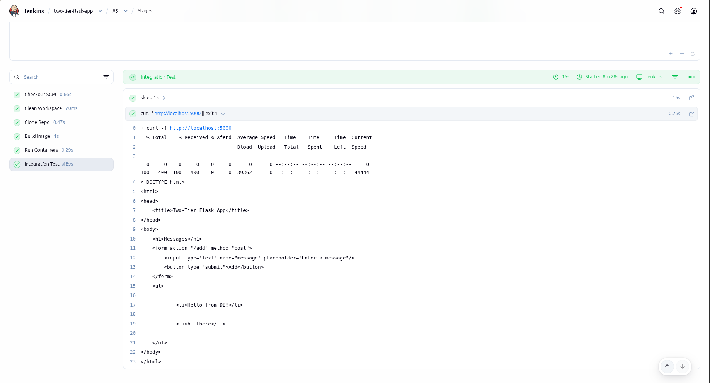

# Two-Tier Flask App with Docker & Jenkins

A fully automated CI/CD pipeline deploying a two-tier web application using Flask, MySQL, Docker, and Jenkins — hosted on a DigitalOcean droplet.

Every push to GitHub automatically triggers a Jenkins build that builds the Docker image, spins up the containers, and runs an integration test.

---

##  Architecture

```
Developer → GitHub → Jenkins (webhook) → Docker Compose → Flask + MySQL
                                                              ↑
                                                           User (port 5000)
```

| Layer | Technology |
|---|---|
| Frontend | Flask (Python 3.9) |
| Database | MySQL 5.7 |
| Containerization | Docker + Docker Compose |
| CI/CD | Jenkins |
| Version Control | GitHub |
| Infrastructure | DigitalOcean Droplet (Ubuntu 22.04) |

---

##  Pipeline Flow

1. Developer pushes code to GitHub
2. GitHub webhook triggers Jenkins automatically
3. Jenkins cleans workspace and clones the latest code
4. Jenkins builds the Docker image for the Flask app
5. Docker Compose spins up Flask + MySQL containers
6. Jenkins runs an integration test (HTTP request to port 5000)
7. Pipeline passes ✅ — app is live

---

##  Prerequisites

- DigitalOcean droplet (Ubuntu 22.04, minimum 2GB RAM)
- Ports open: **22** (SSH), **8080** (Jenkins), **5000** (Flask)
- Java 17, Jenkins, Docker, Docker Compose installed

---

##  Setup Guide

### 1. Provision the server

```bash
# Update system
apt update && apt upgrade -y

# Install Java (required for Jenkins)
apt install fontconfig openjdk-17-jre -y

# Install Jenkins
curl -fsSL https://pkg.jenkins.io/debian-stable/jenkins.io-2023.key | tee /usr/share/keyrings/jenkins-keyring.asc > /dev/null
echo "deb [signed-by=/usr/share/keyrings/jenkins-keyring.asc] https://pkg.jenkins.io/debian-stable binary/" | tee /etc/apt/sources.list.d/jenkins.list > /dev/null
apt update && apt install jenkins -y
systemctl start jenkins && systemctl enable jenkins
```

### 2. Install Docker

```bash
apt install ca-certificates curl gnupg -y
install -m 0755 -d /etc/apt/keyrings
curl -fsSL https://download.docker.com/linux/ubuntu/gpg | gpg --dearmor -o /etc/apt/keyrings/docker.gpg
chmod a+r /etc/apt/keyrings/docker.gpg
echo "deb [arch=$(dpkg --print-architecture) signed-by=/etc/apt/keyrings/docker.gpg] https://download.docker.com/linux/ubuntu $(. /etc/os-release && echo "$VERSION_CODENAME") stable" | tee /etc/apt/sources.list.d/docker.list > /dev/null
apt update && apt install docker-ce docker-ce-cli containerd.io docker-buildx-plugin docker-compose-plugin -y
```

### 3. Give Jenkins permission to use Docker

```bash
usermod -aG docker jenkins
systemctl restart jenkins

# Verify it works
su - jenkins -s /bin/bash -c "docker ps"
```

### 4. Configure Jenkins

- Open `http://<your-droplet-ip>:8080`
- Unlock Jenkins using the initial admin password:
  ```bash
  cat /var/lib/jenkins/secrets/initialAdminPassword
  ```
- Install suggested plugins
- Create a Pipeline job pointing to this GitHub repository
- Set branch to `*/main` and Script Path to `Jenkinsfile`

### 5. Set up GitHub Webhook

- Go to GitHub repo → **Settings → Webhooks → Add webhook**
- Payload URL: `http://<your-droplet-ip>:8080/github-webhook/`
- Content type: `application/json`
- Event: **Just the push event**
- In Jenkins: **Configure → Build Triggers → GitHub hook trigger for GITScm polling** ✅

---

##  Project Structure

```
two-tier-flask-app/
├── app.py              # Flask application
├── Dockerfile          # Flask container definition
├── docker-compose.yml  # Orchestrates Flask + MySQL containers
├── Jenkinsfile         # CI/CD pipeline definition
├── requirements.txt    # Python dependencies
├── init.sql            # Database initialization script
└── templates/          # HTML templates
    └── index.html
```

---

##  Tech Stack Details

**Flask app** (`app.py`) connects to MySQL using `flask-mysqldb` and exposes a simple message board at `/`.

**Docker Compose** (`docker-compose.yml`) defines two services:
- `flask` — builds from the Dockerfile, exposes port 5000
- `mysql` — uses the official MySQL 5.7 image, mounts `init.sql` for initialization

**Jenkinsfile** pipeline stages:
1. `Clean Workspace` — removes old build artifacts
2. `Clone Repo` — pulls latest code from GitHub
3. `Build Image` — builds the Flask Docker image
4. `Run Containers` — runs `docker compose up -d`
5. `Integration Test` — curls `localhost:5000` to verify the app is up

---

##  Running Locally

```bash
git clone https://github.com/idrissrb/two-tier-flask-app.git
cd two-tier-flask-app
docker compose up -d
```

App will be available at `http://localhost:5000`

To stop:
```bash
docker compose down -v
```

---

##  Troubleshooting

### Jenkins build fails with "permission denied" on docker

```bash
usermod -aG docker jenkins
systemctl restart jenkins
```

### MySQL container exits immediately

Check the logs:
```bash
docker logs two-tier-flask-app-mysql-1
```

Most likely cause: a syntax error in `init.sql`. Make sure column names in `INSERT` statements match the column names in `CREATE TABLE`.

### Flask shows "Unknown server host 'mysql'"

MySQL container hasn't finished starting up yet. Increase the `sleep` in the Jenkinsfile integration test stage, or check that MySQL is actually running:
```bash
docker ps -a
```

### curl times out in integration test

Make sure the Jenkinsfile uses `localhost` instead of the public IP:
```groovy
sh 'curl -f http://localhost:5000 || exit 1'
```

Using the public IP from inside the droplet can be blocked by the firewall.

### `docker-compose: not found`

Use the new syntax without the hyphen:
```groovy
sh 'docker compose up -d'   // ✅ correct
sh 'docker-compose up -d'   // ❌ old syntax
```

---

## 📸 Screenshots

### Running app


### Jenkins pipeline


---

## License

MIT
